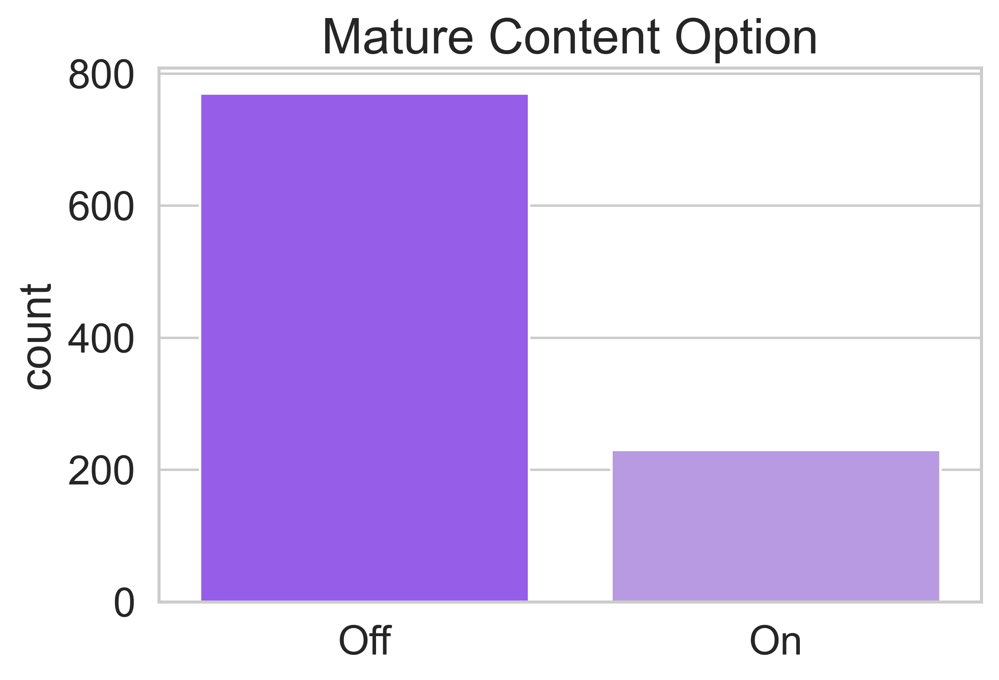
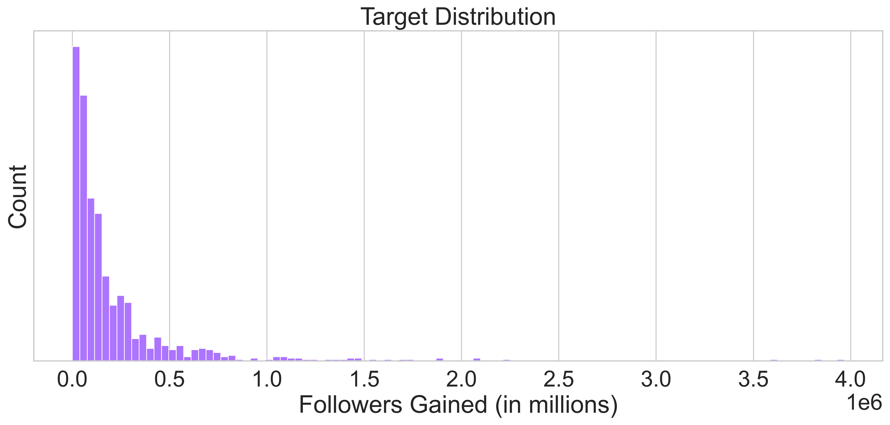
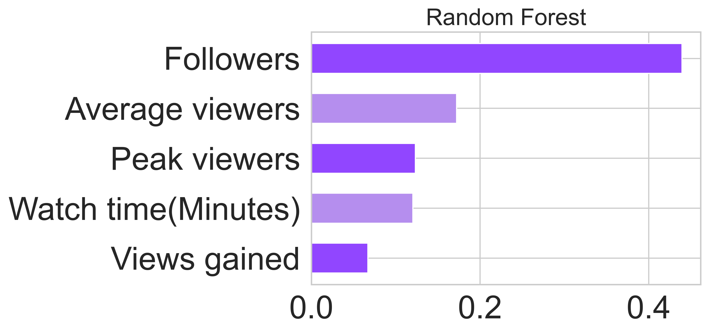

# Live Stream Data Analysis

My project focuses on predicting a number of new followers using machine learning predictive models. The project’s goal is to help streamers to gain more followers that in turn will allow to get sponsorships. I believe, a live streaming is a good way to earn money, since it is becoming more and more popular, especially during the COVID 19 pandemic. With more people losing their regular jobs, live streaming platforms provide an opportunity to make money to a broad number of people. My project is oriented to individual streamers, as well as to sponsors, who wants to partner with a streamer to advertise their products. I am using a data from twitch.tv live streaming service that I found on Kaggle.com. Twitch.tv gained popularity with computer games streaming, but lately musicians’ streams are getting popular as well. In addition, Twitch is used for life chats, so you don’t even need to be skillful in something particular to become a streamer, you can be good at talking and it would be enough to start streaming. Amazon is a parent company of Twitch, and is known for extensively collecting and using data to improve products. The data contains number of viewers, followers and duration of top 1000 streamers.

## Directory Structure

### [Data](https://github.com/oklena/Live_Stream_Data_Analysis/tree/main/data)
This folder conatains all relevant documentation for the data used in this repo.

### [Notebooks](https://github.com/oklena/Live_Stream_Data_Analysis/tree/main/notebooks)
This folder contains jupyter notebooks with exploratory data analyses and the final report notebook.

### [Data](https://github.com/oklena/Live_Stream_Data_Analysis/tree/main/references)
This folder conatains all relevant references to this repo.

### [Reports](https://github.com/oklena/Live_Stream_Data_Analysis/tree/main/reports)
This folder contains a pdf of the slideshow presentation, and images used in the finalized presentation of the data.

### [SRC](https://github.com/oklena/Live_Stream_Data_Analysis/tree/main/src)
This folder contains the source code for created functions for use during this project.

# The Data

The model was trained using a dataset hosted on [Kaggle.com](https://www.kaggle.com/aayushmishra1512/twitchdata): 

* Top Streamers on Twitch

The data can most easily be uploaded to a notebook using the Pandas read .csv method from data/raw folder. 

# Data Exploration

| Channel | Watch time (min) | Stream time (min) | Peak viewers | Average viewers | Followers | Followers gained | Views gained | Partnered | Mature | Language |
| --------|------------------|-------------------|--------------|-----------------|-----------|------------------|--------------|-----------|--------|------------|

My base data, which is the Top Streamers on Twitch dataset, comes with seven numerical columns, two boolean, and two categorical values, with every row being a separate channel. The first column contains the channel name. The second column is the total amount of time in minutes in aggregate that viewers spend watching the channel videos. The third column is the total amount of minutes the channel owner spends streaming. The column "peak viewers" indicates the highest number of concurrent viewers who viewed channel's live video for at least 3 seconds. The next column is the average number of concurrent viewers in a stream calculated by taking a total of the number of viewers of a stream at different points in time when streaming live. Next column is number of channels' followers. Followers gained is the target column – number of new followers. Views gained is the number of latest views. Partnered is true if a channel partnered with Twitch, otherwise is false. Mature is true if a channel has mature content, otherwise is false. The last column shows language a channel speaking. 

# Exploratory Data Analysis

Distribution of stream time, which is the total amount of minutes channel owners spent streaming. Most of the channels spent about 100,000min streaming whish is equal to about 70days.

Correlation between number of followers channels already had in units of millions versus followers gained a number of new followers. Even though we can  notice that having a higher number of followers can help to gain proportionally higher number of new followers, it is not true for many.
For example, some channels had 1,000,000 followers as starting point, but it did not help them to gain more followers.

Since it is an American platform, English is the most popular language, but they are getting popular in Korea and among Russian speaking countries. Still the gap between English and other languages is huge, so plenty of room for them to expand further. 

Streamers on twitch.tv have options. They can turn on Mature content if they are targeting adult audience, I am assuming viewers should be older than 18 years old. From the graph you can see that most of the streamers don’t have this option on, but they should be careful with their vocabulary. 

This data on top 1000 streamers, so most of them are partnering with twitch. They pay some percentage of their earnings to Twitch.

Target is exponential.

# The Models 

I ran 4 shallow models using Linear Regression, Random Forest Regressor, Poisson Regressor and K-Nearest Neighbor Regressor. Grid search was used to find the best hypertuning parameters for my models. Poisson Regression model performed better than other models capturing 50.0% on a variation in a test data. It means the model tracking predicting . 

### Linear Regression Model

Linear regression was used as my first simple model. It is designed to compare the conditional probabilities of many independent features and then uses those calculations to find the total conditional probability of the target feature. The first linear model had mean absolute percentage error of 156.25 and coefficient of determination of 38%. It is lower than 50%, model did not perform well. The remaining 62% of the variability of the dependent variable has not beem accounted for. 

### Random Forest Regressor Model

A random forest regressor uses a discrete function to identify how to give weight to one posibility over another until each possibility has been considered and weighed leaving a clear outcome. The random forest model with hypertuning parameters captured 60% on a variation in a test data.Mean absolute percentage error is 129.31
Overall this model is the most accurate and provides the best performance.

### Poisson Regressor Model

Generalized Linear Model with a Poisson distribution. The data falls on Poisson distribution and meet all the requirements. The target is a random number of a gained followers over given period of time. Mean absolute percentage error is 219.30, coefficient of determination is 21%. It is lower than 50%, model did not perform well. The remaining 79% of the variability of the dependent variable has not been accounted for. 

### K-Nearest Neighbors Model

The K-nearest neighbors model uses a distance metric to identify if a new data point will be labeled the same as features near its predicted location by averaging the number of features with each label and giving the new point the label of the features with the highest mean. KNN should perform well on a small data set. Mean absolute percentage error is 287.80, coefficient of determination is 19%. It is lower than 50%, model did not perform well. The remaining 81% of the variability of the dependent variable has not beem accounted for. 

Random Forest is the final model with the best results. Let's look at the top 5 feature importances and predicted versus true data.

The number of claims (ClaimNb) is a positive integer (0 included). Thus, this target can be modelled by a Poisson distribution. It is then assumed to be the number of discrete events occuring with a constant rate in a given time interval (Exposure, in units of years). Here we model the frequency y = ClaimNb / Exposure, which is still a (scaled) Poisson distribution, and use Exposure as sample_weight.

# Conclusion

Random Forest Model performed better than other models capturing 60.0% on a variation in a test data. It means 60% of the test data fit the regression model. As expected, more followers a channel has it is easier to gain new followers. With more people watching a stream chances to gain new followers are higher. Since English is the most popular language on Twitch, speaking in english gives a good start for a streamer. Also, stream duration has an impact.

# Going Forward:

Recommendations for future model improvement might be using Stacking Regressor with Random Forest. Also, increasing the amount of data might help with training a model. Current data set contains only data of 1000 top channels. Collect more data from Twitch using Twitch API from random channels, not only top ones. Web scraping channels descriptions can be next step, it would be interesting to see how descriptions might affect on viewers decisions to start following, especially for new streamers. It will be NLP project.     
